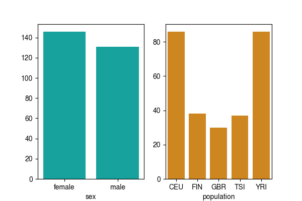
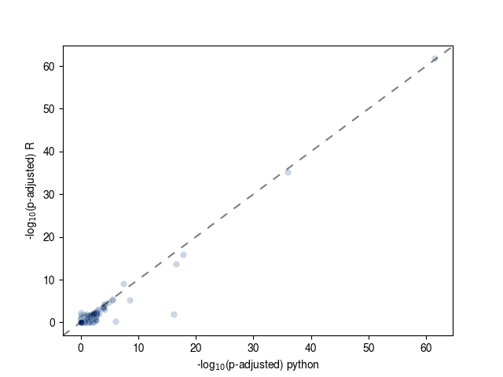
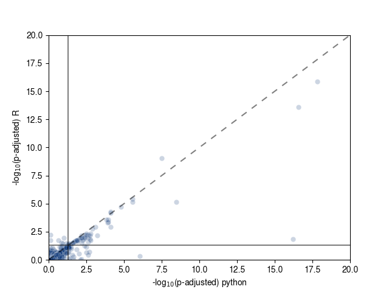
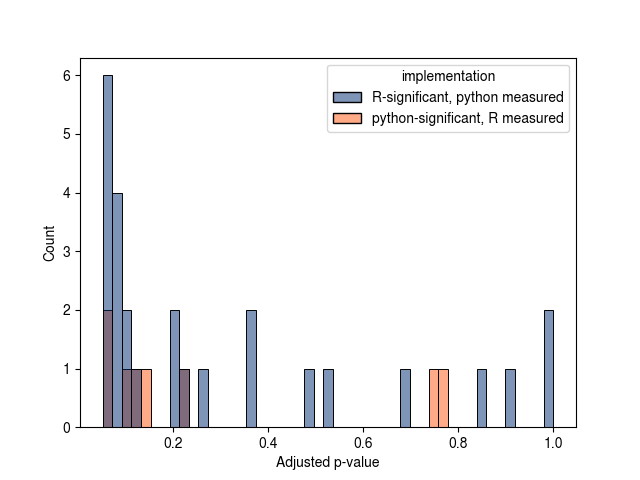
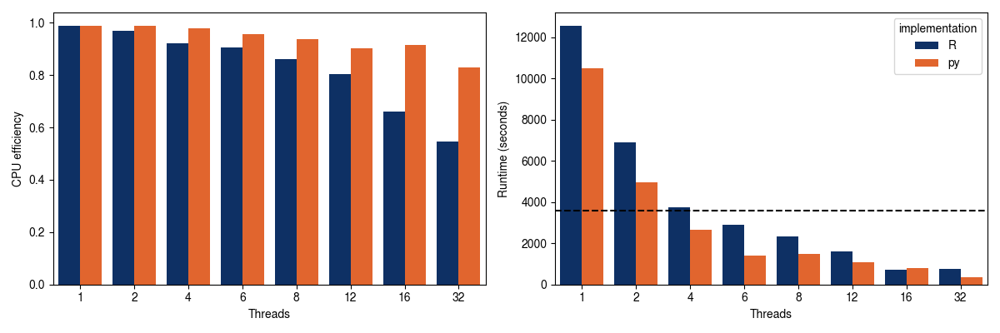

# Comparison with original leafcutter

## Implementation differences

The clustering is identical, but the model fitting and implementation between the R version of leafcutter and the python version has a few differences.

Firstly the R version is based on Stan, while the python version used pyro/pytorch under the hood, both still use Dirichlet-Multinomial modeling for junction counts across clusters and conditions.

## Algorithmic differences

| Approach | R | Python |
|----------|---|--------|
| Model fitting | Full model initialized from null model fit | Full model selected from one initialized from full model or Bayesian Ridge Regression fit |
| Timeout | 30 second timeout | None |
| Concentration parameter | Shared concentration across all K junctions in cluster | Per-junction concentration |

# An applied example

We ran the same data through both python and R pipelines with the same input data.

### The example data

In this case we're using [Geuvadis data](https://www.nature.com/articles/nature12531) which are lymphoblastiod cell lines derived from donors recriuted from different populations. Within these data, we are studying splicing differences that vary across male vs. female donors accounting for the population as a confounder; for this comparison, we are only conisdering samples produced by the same lab.

Below are a breakdown of the sample numbers and metadata.

### Comparison of p-values produced between the two implementations

Below are scatter plots (one standard and another zoomed in) of the FDR adjusted p-values from both implementations.

Dotted lines indicate the x = y line and the solid lines indicate p-adjusted = 0.05.

You'll notice that these are highly correlated (Pearson R = 0.968), but not identical.

| Significant R | Significant Python | Count |
|---------------|--------------------|-------|
| Y | Y | 53 |
| N | N | 27,700 |
| Y | N | 8 |
| N | Y | 26 |

It shouldn't be shocking, given the different implementations that these aren't identical; it also looks like the python version is finding slightly more exclusively significant clusters than the R version. Many of these are close to p-adjusted in 0.05.

Finally, there are a 6 python-only clusters that were successfully fit which were timeouts or failed initializations for the R version.

## Performance

Lastly looking at performance, the python version is modestly more CPU efficient and faster, however requires slightly more memory (for this comparison R comes in at 972 MB and the python version comes in at 1.44 GB). The memory required will vary depending on the sample size and number of variables in the model.

## References

- Original leafcutter: [Li et al. 2018, Nature Genetics](https://www.nature.com/articles/s41588-017-0004-9)
- leafcutter2: [Fair et al. 2024, Nature Genetics](https://doi.org/10.1038/s41588-024-01872-x)
- Geuvadis data: [Lappalainen et al. 2013, Nature](https://www.nature.com/articles/nature12531)
